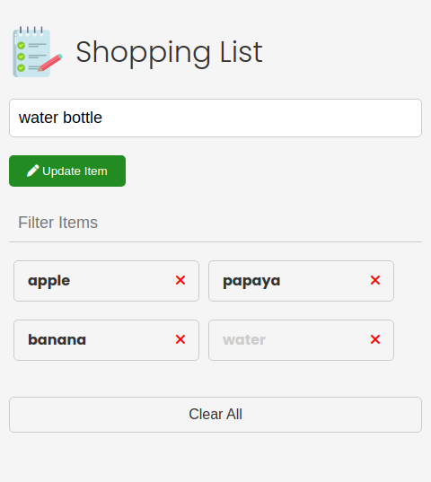

# Shopping-List

This is a [Shopping List](https://ruchibadkur.github.io/HTML---CSS-Mini-Project---HTML---CSS-Mini-Project---ch2pk4gpm3s7/) using html and css. 

## Table of contents

- [Overview](#overview)
  - [The challenge](#the-challenge)
  - [Links](#links)
- [My process](#my-process)
  - [Built with](#built-with)
  - [What I learned](#what-i-learned)
  - [Continued development](#continued-development)
  - [Useful resources](#useful-resources)
- [Author](#author)

## Overview

### The challenge

-  **Shopping List - Ex:** 

### Links

- Live Site URL: 

## My process

### Built with

- HTML
- CSS 
- JAVASCRIPT 

### What I learned

My major learnings while working through this project are:

- HTML5
- CSS 3
- javaScript (ES6)
- DOM 
- Set, get and remove items from local storage.

### Continued development

I want to continue focusing on other **web development technologies** and **devops technologies** and
creating **visually appealing** and **user-friendly** websites, developing sites that are **optimized for search engine ranking**, and ensuring that websites are **properly coded and functional**. In addition, learn  more ways of **maintaining and updating existing websites**, as well as **troubleshooting** any technical issues that may arise.

### Useful resources
- [MDN Docs](https://developer.mozilla.org/en-US/docs/Web/JavaScript) - MDN Web Docs has the most up-to-date and accurate information and the content is presented in an easy-to-understand manner.

- [Traversy Media](https://www.youtube.com/c/TraversyMedia) - Traversy Media features the best online web development and programming tutorials for all of the latest web technologies from the building blocks of HTML, CSS & JavaScript to frontend frameworks like React and Vue to backend technologies like Node.js etc.

## Author

- LinkedIn - [Ruchi badkur](https://www.linkedin.com/in/ruchi-badkur-96a1b5215/)
- Email - badkurruchii@gmail.com